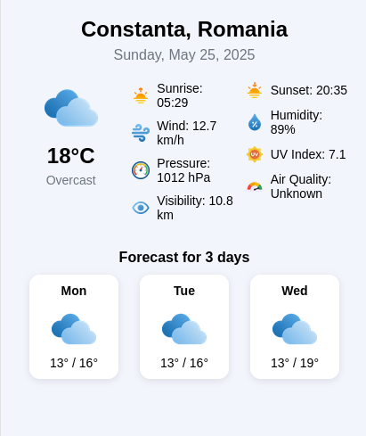

# WeatherDashboard-React-Native-App

Download apk file: https://drive.google.com/file/d/1AClXNbvbffOZpa84F7wX8wQnR7esqEDQ/view?usp=sharing

Weather Dashboard app for Android, developed with React Native, Expo and Genymotion(Android Emulator).

Visual Studio Code Extensions: Babel JS, React Native Tools

How to use:

Open Genymotion, Start

>npx create-expo-app Weather --template

select Blank TypeScript

>cd Weather

copy App.tsx to Weather/

>npx expo start

type a
